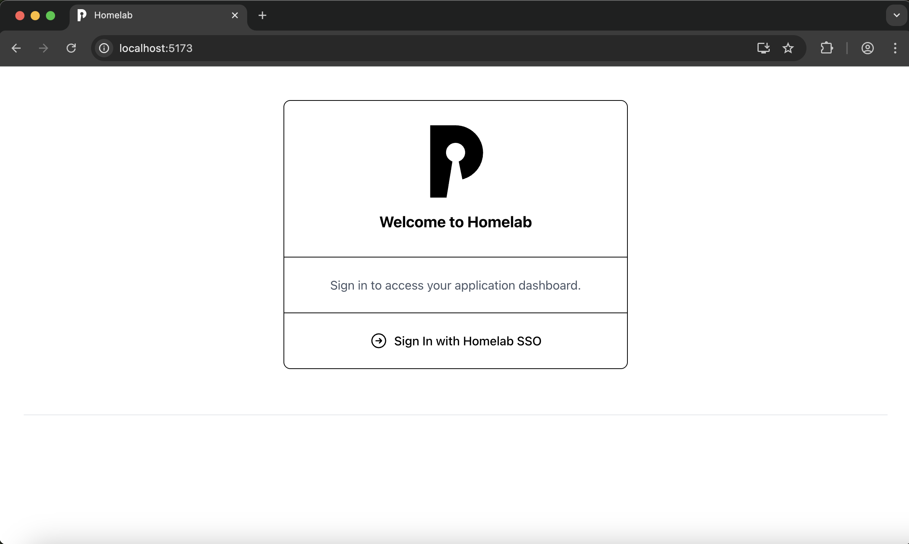
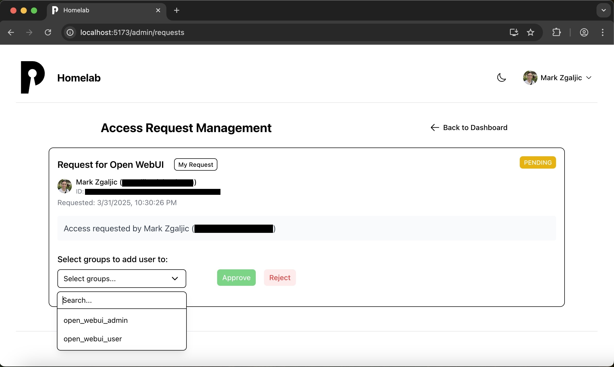

# Pocket ID Dashboard

A web application that provides [Pocket ID](https://github.com/pocket-id/pocket-id) users with a centralized dashboard to access their OIDC applications.

⚠️ Most of the code in this repo was generated by an LLM (about 85%). I have personally reviewed
the security related parts of the project (integrating with pocket id via OIDC w/ pkce, etc).
This web app is not a passion project of mine, it was built to solve a need I had. I only
cared about perfection around the security related parts of the code.

## Features

- Single sign-on with OIDC (PKCE flow - public client)
- View and launch your authorized applications
- Request access to new applications
- Dark mode support
- Admin features:
  - Admins are designated via a user group in Pocket ID (optional)
  - Email notifications for access requests (optional)
  - Manage access requests directly in the UI (approve or reject)

## Screenshots

Here are some screenshots of the Pocket ID Dashboard:

1. **Login Page**  
   <a href="screenshots/login-page.png" target="_blank">
   
   </a>

2. **Dashboard - Light Mode**  
   <a href="screenshots/dashboard-light.png" target="_blank">
   
   </a>

3. **Dashboard - Dark Mode**  
   <a href="screenshots/dashboard-dark.png" target="_blank">
   
   </a>

4. **Request Access to an app (an OIDC client)**  
   <a href="screenshots/request-access.png" target="_blank">
   
   </a>

5. **Access Request Manager**  
   <a href="screenshots/access-request-manager.jpeg" target="_blank">
   
   </a>

6. **Dropdown menu**  
   <a href="screenshots/dropdown-menu.png" target="_blank">
   
   </a>

7. **Mobile View**  
   <a href="screenshots/mobile.png" target="_blank">
   
   </a>


## Quick Start

### Prerequisites

1. **Configure a new OIDC client in Pocket ID**  
   Create a new OIDC client in Pocket ID. For clarity, name it something like “Pocket ID Dashboard.” Then apply the following settings (example):

   ```
   callback url(s):         https://pocket-id-dashboard.mydomain.com/auth/callback
   logout callback url(s):  https://pocket-id-dashboard.mydomain.com
   PKCE:                    true
   Public Client:           true
   ```

2. **Configure environment variables**  
   Create a `.env` file based on the sample located here:  
   https://raw.githubusercontent.com/mzgaljic/pocket-id-dashboard/main/local-dev-sample.env

   Then edit the `.env` file. At minimum, set these required variables:
   ```
   # Required configuration
   OIDC_CLIENT_ID=your_client_id
   OIDC_REDIRECT_URI=https://your-domain.com/auth/callback
   OIDC_POST_LOGOUT_REDIRECT_URI=https://your-domain.com
   POCKET_ID_BASE_URL=https://your-pocket-id-instance
   POCKET_ID_API_KEY=your_api_key
   SESSION_SECRET=your_secure_session_secret 
   ```
   The session secret can be any string. To generate a strong session secret, consider running `npm run generate-secret`. The script is here: [/server/scripts/generate-secret.js](https://github.com/mzgaljic/pocket-id-dashboard/blob/main/server/scripts/generate-secret.js).
   <br/><br/>
   There are many other useful variables, for example `ADMIN_GROUP_NAME` defines the Pocket ID user group
   to use for determining which dashboard users are admins (can manage access requests, clear server cache).

### Run with Docker Compose

Docker images are published to gcr (github container registry), [view versions here](https://github.com/mzgaljic/pocket-id-dashboard/pkgs/container/pocket-id-dashboard/versions).

1. Edit or create a new Docker Compose file (YAML). An example is available here:  
   https://github.com/mzgaljic/pocket-id-dashboard/blob/main/docker-compose.yml

2. Start your containers:
   ```bash
   docker compose up -d
   ```

The application will be accessible at http://localhost:3001 or via the URL defined in `CLIENT_ORIGIN` (configured in `.env`). This README does not cover production deployment or configuring a reverse proxy.

### Run on Bare Metal

<details>
  <summary>Instructions</summary>

1. Clone the repository:
   ```bash
   git clone git@github.com:mzgaljic/pocket-id-dashboard.git
   cd pocket-id-dashboard
   ```
2. Install npm packages and start the app:
   ```bash
   # Install dependencies
   npm install
   cd client && npm install
   cd ..
   npm run start
   ```
</details>


## Database Configuration

See [DATABASE.md](DATABASE.md).

## Customize the dashboard

See [CUSTOMIZE.md](CUSTOMIZE.md).

## Local Development

<details>
  <summary>Instructions</summary>

Run:
```bash
# Install dependencies
npm install
cd client && npm install
cd ..
# Start in development mode
npm run dev
```

OR build and run the docker image:
```bash
docker compose -f docker-compose-dev.yml up
```

</details>


## License

This project is licensed under the [MIT License](LICENSE).